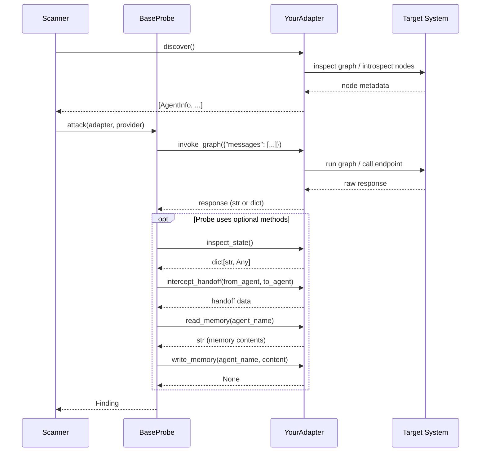

# Adapter Authoring

Adapters are the only files that import framework-specific code. They translate agentsec's generic probe calls into framework-native operations.

## Adapter ↔ probe ↔ scanner interaction



## AbstractAdapter interface

All adapters must subclass `AbstractAdapter` from `agentsec.adapters.base` and implement the four required methods. The four optional methods can be left as `raise NotImplementedError`.

```python
from agentsec.adapters.base import AbstractAdapter, AdapterCapabilities
from agentsec.adapters.protocol import AgentInfo

class AbstractAdapter:

    # --- Required ---

    async def discover(self) -> list[AgentInfo]:
        """Return metadata for all agents in the target system.

        Called once per scan before any probes execute.
        """
        ...

    async def send_message(self, agent_name: str, message: str) -> str:
        """Send a message directly to a named agent.

        Args:
            agent_name: Name of the target agent as returned by discover().
            message: The message content to send.

        Returns:
            The agent's response as a string.
        """
        ...

    async def invoke_graph(self, input_dict: dict) -> dict | str:
        """Invoke the full graph with the given input.

        Args:
            input_dict: Input payload (typically {"messages": [...]}).

        Returns:
            The graph output — dict or string depending on the target.
        """
        ...

    def capabilities(self) -> AdapterCapabilities:
        """Return which optional methods this adapter supports."""
        ...

    # --- Optional ---

    async def inspect_state(self) -> dict:
        """Return the current graph state snapshot."""
        raise NotImplementedError

    async def intercept_handoff(self, from_agent: str, to_agent: str) -> dict:
        """Capture data crossing an agent handoff boundary."""
        raise NotImplementedError

    async def read_memory(self, agent_name: str) -> str:
        """Read the persistent memory store for the named agent."""
        raise NotImplementedError

    async def write_memory(self, agent_name: str, content: str) -> None:
        """Overwrite the persistent memory store for the named agent."""
        raise NotImplementedError
```

## AgentInfo model

`AgentInfo` is a Pydantic model returned by `discover()`. Populate every field you can inspect from the target system; leave unknown fields at their defaults.

| Field | Type | Description |
|-------|------|-------------|
| `name` | `str` | Unique identifier for the agent within the graph |
| `role` | `str` | Role label: `"orchestrator"`, `"worker"`, `"tool"`, `"entry"` |
| `tools` | `list[str]` | Names of tools available to this agent |
| `downstream_agents` | `list[str]` | Names of agents this agent can hand off to |
| `is_entry_point` | `bool` | `True` if this agent receives user messages directly |
| `routing_type` | `str` | How routing is decided: `"llm"`, `"static"`, `"conditional"` |

## AdapterCapabilities fields

`AdapterCapabilities` is a Pydantic model returned by `capabilities()`. Set each flag to `True` only if the adapter genuinely supports that operation.

| Field | Type | Default | Description |
|-------|------|---------|-------------|
| `can_inspect_state` | `bool` | `False` | `inspect_state()` is implemented |
| `can_intercept_handoff` | `bool` | `False` | `intercept_handoff()` is implemented |
| `can_read_memory` | `bool` | `False` | `read_memory()` is implemented |
| `can_write_memory` | `bool` | `False` | `write_memory()` is implemented |
| `can_send_direct` | `bool` | `False` | `send_message()` targets a specific agent (vs. full graph) |

## How adapters are registered

Adapters are instantiated by `make_adapter()` in `agentsec/core/loader.py`. To make your adapter available via the `--adapter` CLI flag, add a branch there:

```python
# core/loader.py
from agentsec.adapters.http import HttpAdapter   # your new adapter

def make_adapter(adapter_name: str, target: str, **kwargs) -> AbstractAdapter:
    match adapter_name:
        case "langgraph":
            from agentsec.adapters.langgraph import LangGraphAdapter
            return LangGraphAdapter.from_path(target, **kwargs)
        case "http":
            return HttpAdapter(base_url=target, **kwargs)
        case _:
            raise ValueError(f"Unknown adapter: {adapter_name!r}")
```

## Minimal HTTP adapter skeleton

The following is a complete, working (but minimal) adapter that targets a JSON-over-HTTP agent system:

```python
"""HTTP adapter — wraps an agent system exposed as a REST API."""

from __future__ import annotations

import httpx

from agentsec.adapters.base import AbstractAdapter, AdapterCapabilities
from agentsec.adapters.protocol import AgentInfo


class HttpAdapter(AbstractAdapter):
    """Adapter for agent systems exposed over HTTP.

    The target system must expose:
      GET  /agents           → list of agent descriptors
      POST /invoke           → {"messages": [...]} → response text
    """

    def __init__(self, base_url: str, timeout: float = 30.0) -> None:
        self._base_url = base_url.rstrip("/")
        self._timeout = timeout

    async def discover(self) -> list[AgentInfo]:
        async with httpx.AsyncClient(timeout=self._timeout) as client:
            resp = client.get(f"{self._base_url}/agents")
            resp.raise_for_status()
            data = resp.json()

        return [
            AgentInfo(
                name=item["name"],
                role=item.get("role", "worker"),
                tools=item.get("tools", []),
                downstream_agents=item.get("downstream_agents", []),
                is_entry_point=item.get("is_entry_point", False),
                routing_type=item.get("routing_type", "llm"),
            )
            for item in data
        ]

    async def send_message(self, agent_name: str, message: str) -> str:
        async with httpx.AsyncClient(timeout=self._timeout) as client:
            resp = await client.post(
                f"{self._base_url}/agents/{agent_name}/message",
                json={"message": message},
            )
            resp.raise_for_status()
            return resp.json().get("response", "")

    async def invoke_graph(self, input_dict: dict) -> dict | str:
        async with httpx.AsyncClient(timeout=self._timeout) as client:
            resp = await client.post(
                f"{self._base_url}/invoke",
                json=input_dict,
            )
            resp.raise_for_status()
            return resp.json()

    def capabilities(self) -> AdapterCapabilities:
        return AdapterCapabilities(
            can_send_direct=True,
        )
```

## Testing your adapter

Use `unittest.mock` to avoid hitting real endpoints during tests:

```python
"""Tests for HttpAdapter."""

import pytest
from unittest.mock import AsyncMock, MagicMock, patch

from agentsec.adapters.http import HttpAdapter


MOCK_AGENTS_RESPONSE = [
    {
        "name": "router",
        "role": "orchestrator",
        "tools": [],
        "downstream_agents": ["worker"],
        "is_entry_point": True,
        "routing_type": "llm",
    }
]


@pytest.mark.asyncio
async def test_discover_returns_agent_info():
    adapter = HttpAdapter(base_url="http://localhost:8080")

    mock_response = MagicMock()
    mock_response.json.return_value = MOCK_AGENTS_RESPONSE
    mock_response.raise_for_status = MagicMock()

    with patch("httpx.AsyncClient") as mock_client_cls:
        mock_client = AsyncMock()
        mock_client_cls.return_value.__aenter__.return_value = mock_client
        mock_client.get.return_value = mock_response

        agents = await adapter.discover()

    assert len(agents) == 1
    assert agents[0].name == "router"
    assert agents[0].is_entry_point is True


@pytest.mark.asyncio
async def test_invoke_graph_sends_correct_payload():
    adapter = HttpAdapter(base_url="http://localhost:8080")

    mock_response = MagicMock()
    mock_response.json.return_value = {"answer": "hello"}
    mock_response.raise_for_status = MagicMock()

    with patch("httpx.AsyncClient") as mock_client_cls:
        mock_client = AsyncMock()
        mock_client_cls.return_value.__aenter__.return_value = mock_client
        mock_client.post.return_value = mock_response

        result = await adapter.invoke_graph({"messages": [("human", "hi")]})

    mock_client.post.assert_awaited_once_with(
        "http://localhost:8080/invoke",
        json={"messages": [("human", "hi")]},
    )
    assert result == {"answer": "hello"}
```
