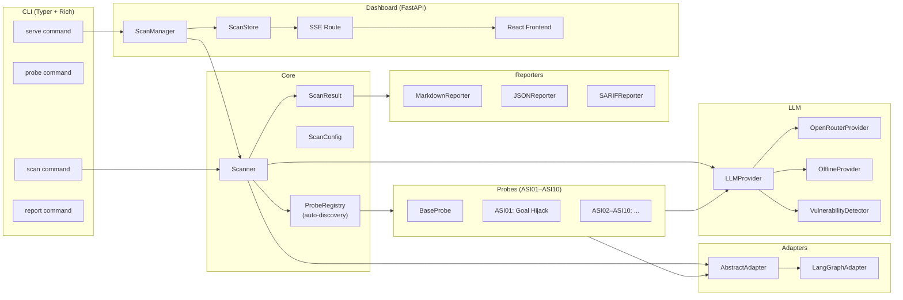
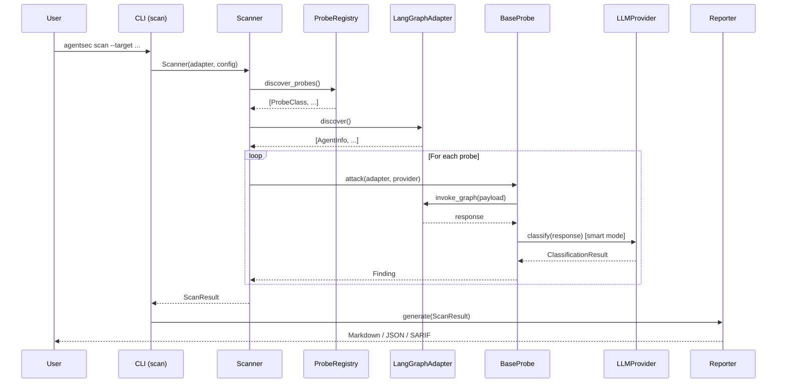

# Architecture

## System overview



## Data flow: CLI scan to report



## Component responsibilities

| Component | File | Responsibility |
|-----------|------|----------------|
| `Scanner` | `core/scanner.py` | Orchestrates probe loop, filters by config, aggregates `ScanResult` |
| `ProbeRegistry` | `probes/registry.py` | Auto-discovers `BaseProbe` subclasses from `probes/asi*/` directories |
| `BaseProbe` | `core/probe_base.py` | Abstract base — `metadata()`, `attack()`, `remediation()`, shared detection logic |
| `AbstractAdapter` | `adapters/base.py` | Interface between probes and target systems |
| `LangGraphAdapter` | `adapters/langgraph.py` | Wraps a compiled LangGraph graph object |
| `LLMProvider` | `llm/provider.py` | Abstract interface for payload generation and classification |
| `OpenRouterProvider` | `llm/openrouter.py` | OpenRouter HTTP client — smart mode |
| `OfflineProvider` | `llm/offline.py` | Returns hardcoded payloads — no API key needed |
| `VulnerabilityDetector` | `llm/detection.py` | LLM-based semantic vulnerability analysis |
| `ScanConfig` | `core/config.py` | Pydantic Settings model — env var prefix `AGENTSEC_` |
| `ScanResult` | `core/scanner.py` | Aggregated probe results with usage stats |
| `ScanManager` | `dashboard/scan_manager.py` | Runs scans async, emits progress events |
| `ScanStore` | `dashboard/store.py` | In-memory scan state and finding overrides |

## Key design rules

1. **Probes never import LangGraph.** All framework interaction goes through `AbstractAdapter`. Probes stay framework-agnostic.
2. **Adapters are the only framework boundary.** `LangGraphAdapter` is the only file that imports `langgraph`.
3. **Registry auto-discovers.** Drop a file in `probes/asi<NN>_<name>/` and it registers automatically — no manual registration.
4. **LLM is injected, never imported by probes.** Probes receive a `provider` argument in `attack()`. They never instantiate `LLMProvider` directly.
5. **Every finding has a remediation.** `BaseProbe.remediation()` is abstract — it cannot be omitted.
6. **Business logic stays out of CLI.** CLI commands call `Scanner.run()` and pass the result to a reporter. No scan logic in `cli/main.py`.

## Module dependency rules

```
cli/          → core/, reporters/
probes/       → core/, llm/ (via injected provider only)
adapters/     → core/
llm/          → core/
reporters/    → core/
dashboard/    → core/, probes/, adapters/
```

Circular imports are forbidden. `probes/` must never import `adapters/`.
