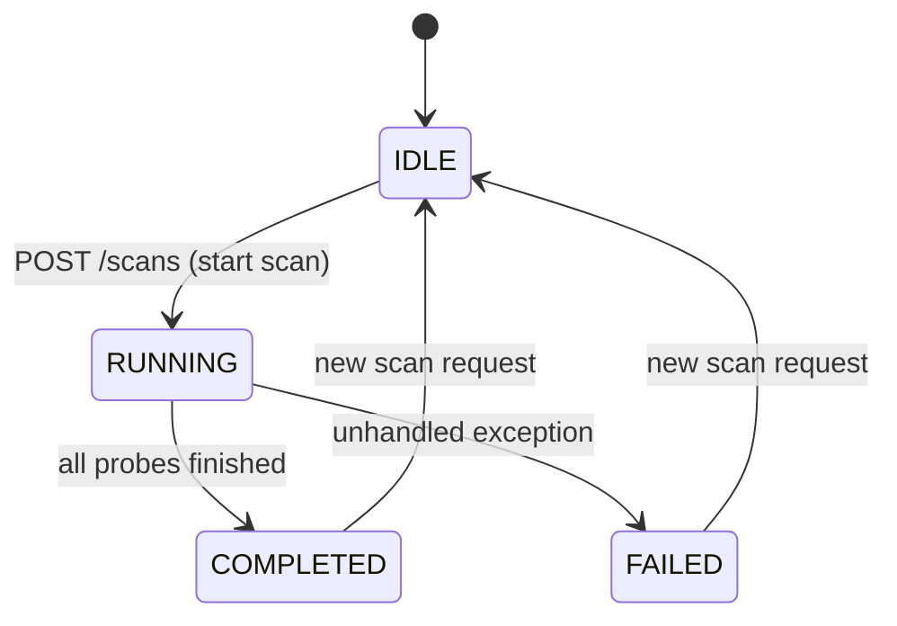
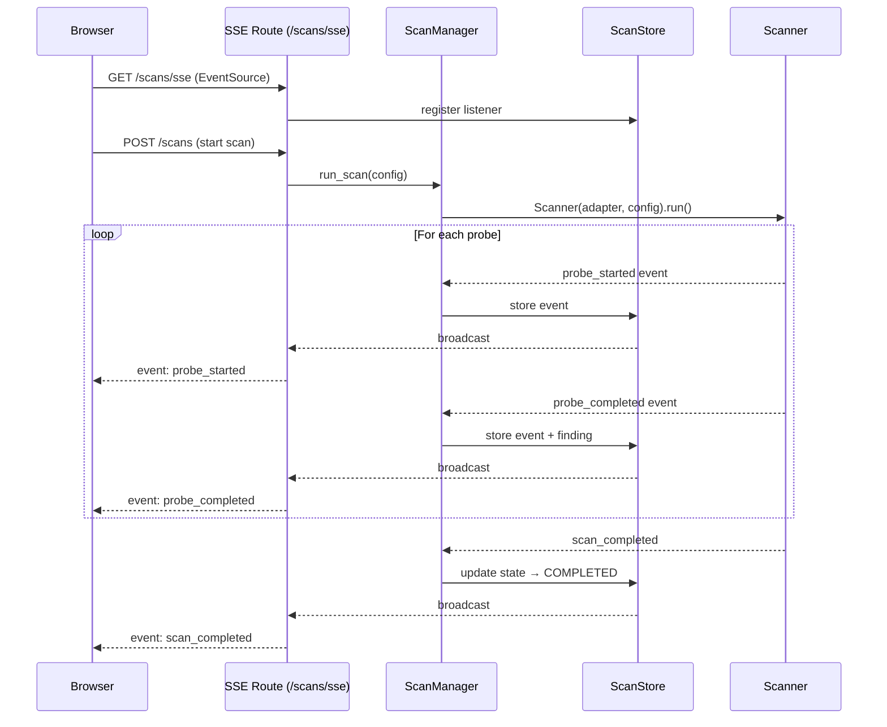

# Dashboard Internals

The agentsec dashboard is a FastAPI application that exposes real-time scan results over Server-Sent Events (SSE) to a React frontend. It is started with `agentsec serve`.

## Scan state machine



A scan moves through these states exactly once per invocation. `ScanStore` persists the current state so that clients that connect mid-scan via SSE receive the correct initial state.

## SSE broadcast topology



## FastAPI app structure

The app is defined in `dashboard/app.py` and uses FastAPI's lifespan context manager to inject shared state into all route modules before the first request.

```python
# dashboard/app.py (simplified)
from contextlib import asynccontextmanager
from fastapi import FastAPI
from fastapi.middleware.cors import CORSMiddleware

from agentsec.dashboard.store import ScanStore
from agentsec.dashboard.scan_manager import ScanManager


@asynccontextmanager
async def lifespan(app: FastAPI):
    store = ScanStore()
    manager = ScanManager(store=store)

    # Inject into route modules so they don't need global state
    app.state.store = store
    app.state.manager = manager
    yield


app = FastAPI(lifespan=lifespan)

app.add_middleware(
    CORSMiddleware,
    allow_origins=["http://localhost:5173"],   # Vite dev server
    allow_credentials=True,
    allow_methods=["*"],
    allow_headers=["*"],
)

# Route modules
from agentsec.dashboard.routes import targets, probes, scans, sse, overrides

app.include_router(targets.router)
app.include_router(probes.router)
app.include_router(scans.router)
app.include_router(sse.router)
app.include_router(overrides.router)
```

### Route modules

| Route module | Prefix | Key endpoints |
|--------------|--------|---------------|
| `targets` | `/targets` | List and register scan targets |
| `probes` | `/probes` | List available probes and their metadata |
| `scans` | `/scans` | Start, list, and retrieve scan results |
| `sse` | `/scans/sse` | SSE stream for real-time scan progress |
| `overrides` | `/scans/{id}/findings/{probe_id}/override` | Override finding status with compliance flag |

### CORS configuration

The dashboard allows cross-origin requests from `http://localhost:5173` (the Vite development server). In production, replace this origin with your actual frontend URL. Do not use `allow_origins=["*"]` — this disables credential sharing.

## ScanStore

`ScanStore` (`dashboard/store.py`) is an in-memory data structure that holds:

- **Scan states** — maps `scan_id` (UUID string) to a `ScanState` object containing status, config, start time, and a list of findings accumulated so far.
- **Finding overrides** — maps `(scan_id, probe_id)` to an override record containing a new `FindingStatus` and a `compliance_flag` string (e.g., `"ACCEPTED_RISK"`, `"FALSE_POSITIVE"`, `"COMPENSATING_CONTROL"`).
- **SSE listeners** — a list of async queues, one per connected browser. Events are broadcast by putting items onto every queue simultaneously.

`ScanStore` has no persistence layer — all data is lost when the server process restarts. For persistent storage, replace the in-memory dicts with a database-backed implementation that satisfies the same interface.

## ScanManager

`ScanManager` (`dashboard/scan_manager.py`) is responsible for:

1. Accepting a scan request (adapter name, target path, config overrides).
2. Constructing the `Scanner` and running it in a background `asyncio` task so the HTTP response returns immediately.
3. Emitting SSE events to `ScanStore` as each probe starts and completes.
4. Updating the scan's terminal state (`COMPLETED` or `FAILED`) when the scanner finishes.

Multiple scans can run concurrently — each gets its own background task and its own `scan_id`.

## SSE event types

| Event type | When emitted | Payload fields |
|------------|-------------|----------------|
| `probe_started` | Immediately before `probe.attack()` is called | `scan_id`, `probe_id`, `probe_name`, `timestamp` |
| `probe_completed` | After `probe.attack()` returns a `Finding` | `scan_id`, `probe_id`, `status`, `severity`, `finding` (full JSON) |
| `scan_completed` | After all probes finish successfully | `scan_id`, `total_findings`, `vulnerable_count`, `duration_seconds` |
| `scan_failed` | After an unhandled exception in the scanner | `scan_id`, `error`, `traceback` |

All events are JSON-encoded. The browser EventSource listener should switch on `event.type`:

```javascript
const source = new EventSource("/scans/sse");
source.addEventListener("probe_completed", (e) => {
  const data = JSON.parse(e.data);
  updateFindingTable(data.finding);
});
source.addEventListener("scan_completed", (e) => {
  const data = JSON.parse(e.data);
  showScanSummary(data);
});
```

## Frontend build instructions

The React frontend lives in `dashboard/frontend/`. It uses Vite and Tailwind CSS.

```bash
# Install JS dependencies
cd dashboard/frontend
npm install

# Start the Vite dev server (proxies API calls to FastAPI on :8000)
npm run dev

# Build for production (output goes to dashboard/frontend/dist/)
npm run build
```

When running in production, serve the built `dist/` directory as static files from FastAPI:

```python
from fastapi.staticfiles import StaticFiles
app.mount("/", StaticFiles(directory="dashboard/frontend/dist", html=True), name="frontend")
```

For local development, start both servers in separate terminals:

```bash
# Terminal 1 — FastAPI backend
uv run agentsec serve --port 8000

# Terminal 2 — Vite frontend
cd dashboard/frontend && npm run dev
```

The Vite dev server runs on port 5173 and proxies `/api/` requests to `localhost:8000`, matching the CORS allowlist.
