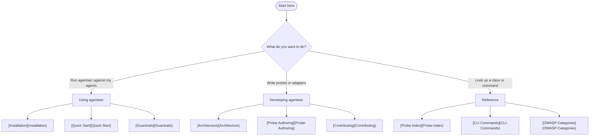

# agentsec

> Red-team and harden multi-agent LLM systems against OWASP Agentic Top 10

agentsec probes your multi-agent LLM system for vulnerabilities, scores findings against the [OWASP Top 10 for Agentic Applications (2026)](https://genai.owasp.org/resource/owasp-top-10-for-agentic-applications-for-2026/), and generates actionable remediation reports with copy-pasteable fixes.

**Break your agents. Fix the holes. Ship with confidence.**

---

## Which section do you need?

---

## Using agentsec

For security engineers and DevSecOps teams running agentsec against their own systems.

| | |
|--|--|
| **[Installation](Installation)** | pip, uv, extras, env vars |
| **[Quick Start](Quick-Start)** | First scan in three commands |
| **[Scan Modes](Scan-Modes)** | Offline vs Smart mode |
| **[Probe Selector](Probe-Selector)** | Filter by probe ID, category, or severity |
| **[CLI Reference](CLI-Reference)** | All commands and flags |
| **[Output Formats](Output-Formats)** | Markdown, JSON, SARIF |
| **[CI Integration](CI-Integration)** | GitHub Actions, GitLab CI |
| **[Guardrails](Guardrails)** | Drop-in defensive components |
| **[Web Dashboard](Web-Dashboard)** | `agentsec serve` UI walkthrough |
| **[Real-World Targets](Real-World-Targets)** | 6 bundled harnesses |

---

## Developing agentsec

For contributors writing new probes, adapters, or framework components.

| | |
|--|--|
| **[Architecture](Architecture)** | System overview and data flow |
| **[Probe Authoring](Probe-Authoring)** | Write a new probe end-to-end |
| **[Adapter Authoring](Adapter-Authoring)** | Write a new framework adapter |
| **[LLM Integration](LLM-Integration)** | LLMProvider, OpenRouter, offline fallback |
| **[Detection Pipeline](Detection-Pipeline)** | Marker vs semantic detection |
| **[Dashboard Internals](Dashboard-Internals)** | FastAPI, SSE, ScanManager |
| **[Testing Guide](Testing-Guide)** | pytest-asyncio, fixtures, mocking |
| **[Contributing](Contributing)** | Dev setup, commit style, PR workflow |

---

## Reference

| | |
|--|--|
| **[Probe Index](Probe-Index)** | All 20 probes — ID, category, severity |
| **[OWASP Categories](OWASP-Categories)** | All 10 ASI categories |
| **[API: BaseProbe](API-BaseProbe)** | Probe base class and ProbeMetadata |
| **[API: BaseAdapter](API-BaseAdapter)** | Adapter interface |
| **[API: Finding](API-Finding)** | Finding, Evidence, Remediation models |
| **[API: ScanConfig](API-ScanConfig)** | Scan configuration |
| **[API: LLMProvider](API-LLMProvider)** | LLM provider interface |
| **[API: Guardrails](API-Guardrails)** | All four guardrail classes |
| **[API: Reporters](API-Reporters)** | Markdown, JSON, SARIF reporters |
| **[CLI Commands](CLI-Commands)** | Full flag reference |
